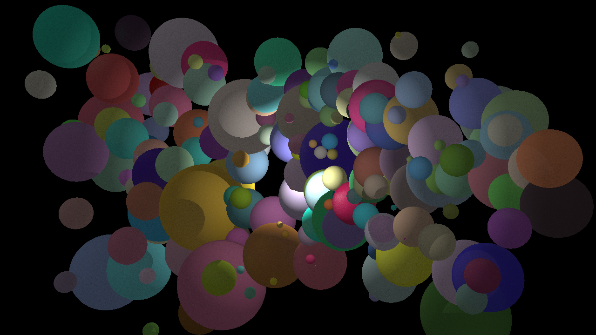

# SyntheseImage-C-Sharp
Implémentaion RayTracer en C#

# Première implémentation

Intégration des fonctions d'écriture de l'image pixel par pixel dans un fichier, fonction d'intersection rayon sphère et gestion de la perspective. Un rayon est envoyé depuis chaque pixel de la camera et s'il rebondit sur la surface d'une sphère, on vérifie si la source de lumière éclaire ce point de la sphère.

# Ajout des couleurs (matériaux diffus) et dégradé de couleur

La couleur affiché par un pixel changera en fonction de l'angle avec lequel le rayon de lumière tape le point de la sphère. Si le rayon de lumière frappe un point de la sphère perpendiculairement, ce point apparaitra très claire.

# Ajout du materiau mirroir et gestion de la lumière indirecte

La scène est uniquement composée de sphères. Les murs sont en réalité des sphères géantes. La gestion des mirroirs et de la lumière indirecte se fait en faisant rebondir plusieurs fois un rayon lancé à partir de la caméra. Chaque rayon envoyé par chaque pixel de la camera rebondira un certain nombre de fois dans la scène, vérifiant l'angle avec lequel il s'intersect avec les autres sphères de la scène, en vérifiant si le point intersecté est éclairé par le source de lumière et en vérifiant la couleur du matériau (qu'il soit diffus ou mirroir).

# Implémentation d'une structure accélératrice

Avant l'implémentation de la structure accélératrice, la production d'une image de résolution 1280 x720 avec une dizaine de sphères dans la scènes prenait environ 5 minutes. Chaque rayon envoyé depuis la camera devait faire une dizaine de rebonds et vérifier à chaque fois s'il entre en intersection avec l'une des sphères de la scène. Lorsqu'on augmentait le nombre de sphère dans la scène, le temps pour sortir un image augmentait plus que proportionnellement. 
Avec l'implémentation de la structure accélératrice, pour une même durée, il est possible de gérer 200 sphères. Cela s'est fait à l'aide de boites englobantes qui ont permis de réduire le nombre de sphère à vérifier lors des rebonds des rayons. Les boites englobantes englobe un certains nombre de sphères en fonction de leurs position dans la scène et permetent de réduire l'espace de recheche des rayons lorsqu'il rebondissent.

